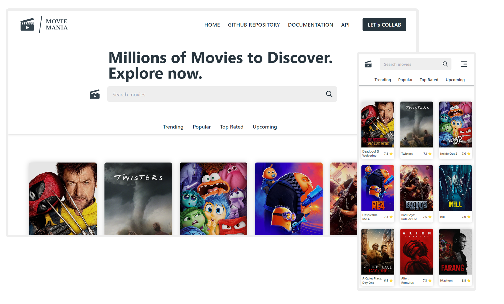
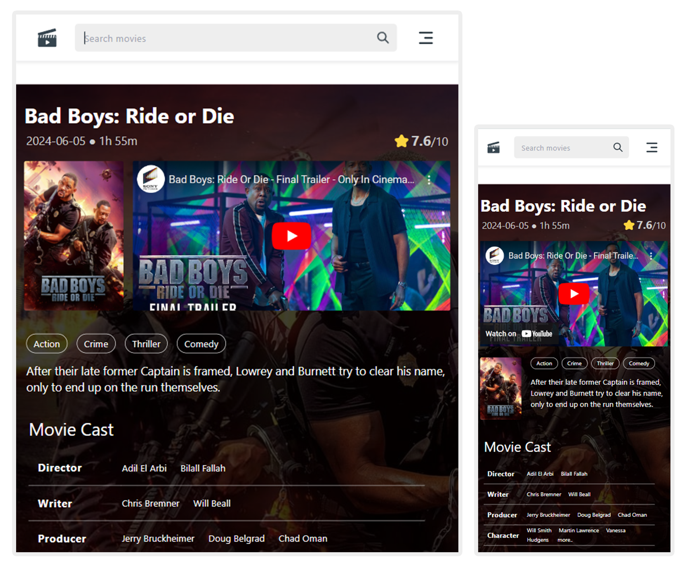
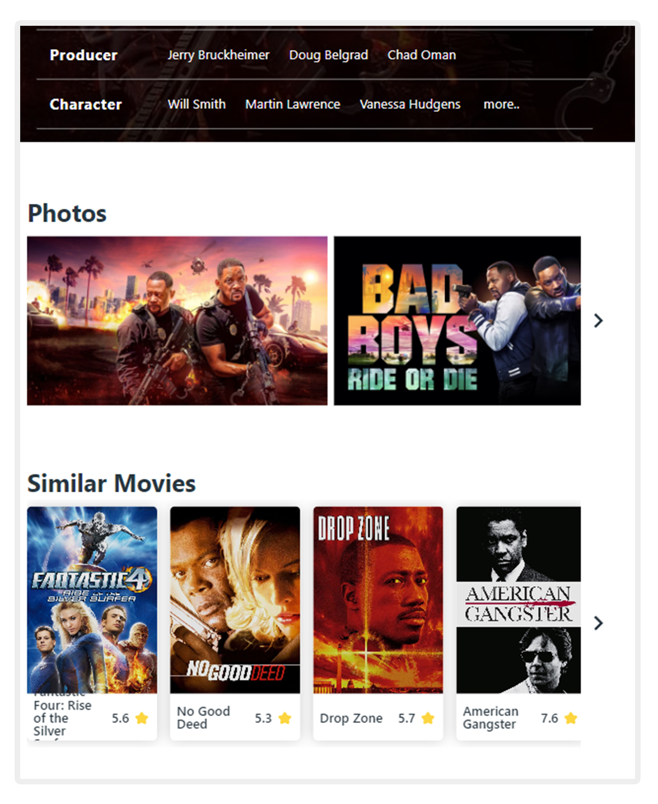

# Movie Mania

Movie Mania is a comprehensive movie database platform, inspired by IMDb. It provides comprehensive details about movies, including trailers, cast and crew, photos, and similar movies. The platform is designed to offer users a visually appealing and user-friendly experience, making it easy to explore movies and their associated content.

## Features

- **Movie Details:** Displays comprehensive details including the title, release date, runtime, rating, genres, overview, and cast.
- **Movie Trailers:** Watch trailers directly on the platform.
- **Cast Information:** View detailed information about directors, writers, producers, and main characters.
- **Similar Movies:** Discover movies similar to the one you're viewing.
- **Photo Gallery:** Provides a scrollable gallery of movie stills and promotional images. Browse high-quality movie stills and posters.
- **Responsive Design:** Fully responsive across various devices, providing a seamless experience on mobile, tablet, and desktop.

## Upcoming Features

- **User Accounts:** Create accounts and personalize your experience.
- **Backend Integration:** Implementation of a backend service to store user data, manage sessions, and handle authentication.
- **Reviews and Ratings:** Users will be able to submit reviews and rate movies directly within the platform.
- **Watchlist:** Add movies to your watchlist for easy access later.
- **Personalized Recommendations:** Get recommendations based on your watch history.

## Technologies Used

- **React.js:** Core framework for building the UI.
- **Tailwind CSS:** For responsive and modern styling.
- **React Icons:** Used for including icons like arrows and other UI elements.
- **TMDb API:** Fetching movie data including details, images, and videos.

## Screenshots

### Home Page



### Movie Details Page





## Problems and Challenges

During the development of Movie Mania, some challenges were encountered, including:

- **API Data Handling:** Efficiently managing and displaying large datasets from the TMDb API.
- **Responsive Design:** Ensuring the application maintained a high-quality UI across different devices.
- **Trailer Embedding:** Integrating YouTube trailers seamlessly into the UI.

## Setup Instructions

To run this project locally, follow these steps:

1. **Clone the repository:**

   ```bash
   git clone https://github.com/jatinkaushik-jk/Movie-Mania.git
   ```

2. **Navigate to the project directory:**

   ```bash
   cd Movie-Mania
   ```

3. **Install the dependencies:**

   ```bash
   npm install
   ```

4. **Create a `.env` file in the root directory and add your TMDb API key:**

   ```env
   VITE_TMDB_API_KEY=your_api_key_here
   ```

5. **Start the development server:**
   ```bash
   npm run dev
   ```

## Contact

If you have any questions or suggestions, feel free to reach out to me on [LinkedIn](https://www.linkedin.com/in/jatinkaushik-jk) or [GitHub](https://github.com/jatinkaushik-jk).
